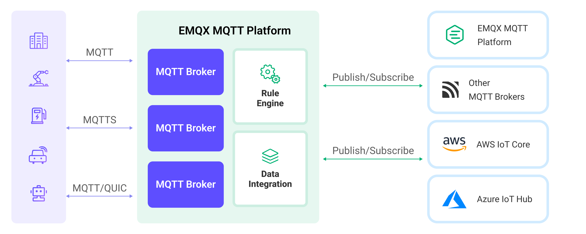
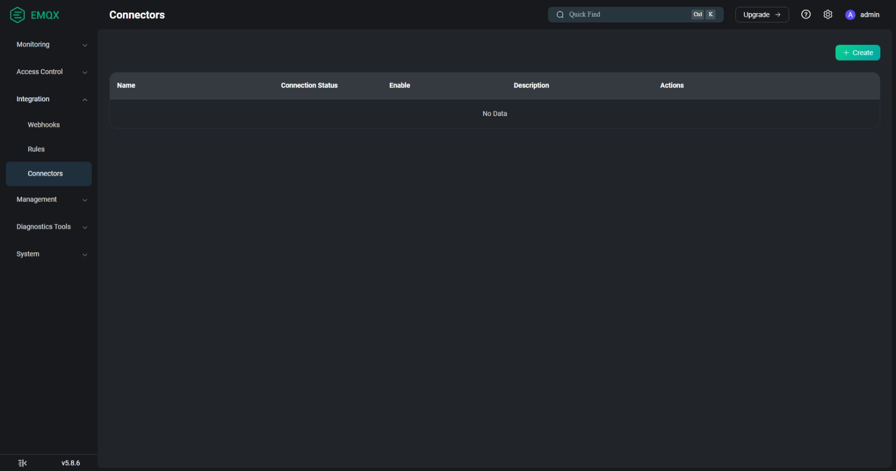
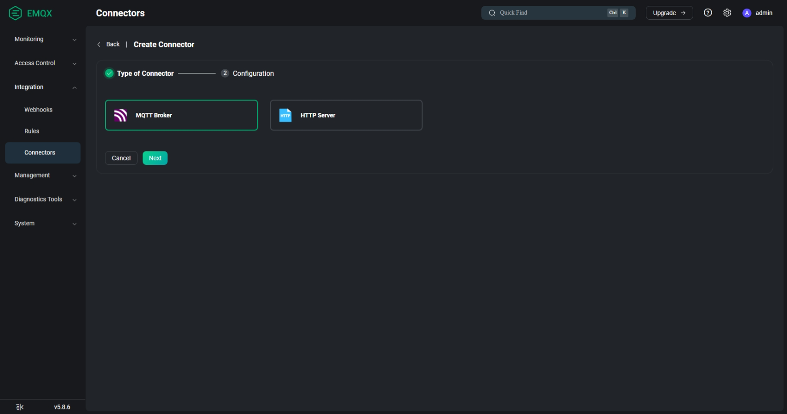
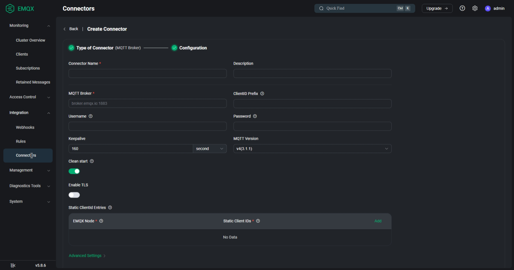

# Explore IoT Operations

This further extends the [Explore IoT Operations](https://github.com/Azure-Samples/explore-iot-operations) repo to evaluate integration capabilities with other IoT Platforms such as EMQx.

## Features

This project provides the following:

* Pre-configured codespace with [K3s](https://k3s.io/) cluster via [K3d](https://k3d.io/)
* EMQX MQTT Broker running as a pod within K3D
* AIO MQTT Broker running as a pod within K3D
* MQTT Bridge configured from EMQX to AIO for message forwarding
* MQTT Device Simulator for publishing and subscribing to topics
* HTTP & GRPC Callout Server

## Getting Started

Use this GitHub codespace to explore Azure IoT Operations in your browser without installing anything on your local machine.

   [](https://codespaces.new/ldandrade/explore-iot-operations?quickstart=1)

(Optional) Enter your Azure details to store them as environment variables inside the codespace.

### Azure IoT Operations Setup

1. **Important**: Open the codespace in VS Code Desktop with **Ctrl/Cmd + Shift + P** > **Codespaces: Open in VS Code Desktop**. This is required to login to Azure CLI properly.

1. Connect your new cluster to Azure Arc.

   ```bash
   az login
   az account set -s $SUBSCRIPTION_ID
   ```

1. Arc Connect your K3S/K3D Cluster by running the arcConnect shell script:

   ```bash
   ./scripts/arcConnect.sh
   ```

1. Deploy Azure IoT Operations by running the iotopsQuickstart shell script:

   ```bash
   ./scripts/iotopsQuickstart.sh
   ```
   
   > **Note:** You may need to run chmod in VS Code Codespaces terminal to allow the execution of the shell script.

1. For detailed information refer to [Azure IoT Operations docs](https://learn.microsoft.com/azure/iot-operations/get-started/quickstart-deploy?tabs=codespaces).

1. Once Azure IoT Operations is deployed, you can access the Operations Experience Web UI.

   To sign in to the operations experience web UI, you need a Microsoft Entra ID account with at least contributor permissions for the **resource group** that contains your Kubernetes - Azure Arc instance. 

   > Note: You can't sign in with a Microsoft account (MSA). 

   To create a suitable Microsoft Entra ID account in your Azure tenant:

   * Sign in to the Azure portal with the same tenant and user name that you used to deploy Azure IoT Operations.
   * In the Azure portal, go to the Microsoft Entra ID section, select Users > +New user > Create new user. Create a new user and make a note of the password, you need it to sign in later.
   * In the Azure portal, go to the resource group that contains your Kubernetes - Azure Arc instance. On the Access control (IAM) page, select +Add > Add role assignment.
   * On the Add role assignment page, select Privileged administrator roles. Then select Contributor and then select Next.
   * On the Members page, add your new user to the role.
   * Select Review and assign to complete setting up the new user.

   You can now use the new user account to sign in to the Azure IoT Operations portal.

   You can continue this thread following the documentation on [Manage asset configurations remotely](https://learn.microsoft.com/en-us/azure/iot-operations/discover-manage-assets/howto-manage-assets-remotely?tabs=portal).

### EMQX Setup

1. Run the following commands inside Codespaces to deploy EMQX:
   ```bash
   kubectl apply -f k8s/emqx/emqx-deployment.yaml
   kubectl apply -f k8s/emqx/emqx-service.yaml
   ```

1. Check that EMQX is running:
   ```bash
   kubectl get pods -l app=emqx
   kubectl get svc emqx-service
   ```

1. Port-forward the EMQX Dashboard by running the following command:
   ```bash
   kubectl port-forward <emqx-pod-name> 18083:18083 &
   ```

### MQTT Bridge Configuration

This repository considers Azure IoT Operations as the sink MQTT service, thus having EMQX MQTT Broker as one of the possible sources of messages. A detailed explanation can be seen in the EMQX documentation page: [Bridge with Other MQTT Services](https://docs.emqx.com/en/emqx/latest/data-integration/data-bridge-mqtt.html#how-it-works)



#### Using EMQX Dashboard

1. Open the EMQX Dashboard and go to the Connectors page.

   

2. Click on Create and select MQTT Broker

   

3. Fill the form with the following information:

   * Connector Name:
   * Description:
   * MQTT Broker:
   * ClientID Prefix:
   * Username:
   * Password:
   * MQTT Version:
   * Enable TLS:
   
   

4. Click Create.

## Trademark Notice

Trademarks This project may contain trademarks or logos for projects, products, or services. Authorized use of Microsoft trademarks or logos is subject to and must follow [Microsoft’s Trademark & Brand Guidelines](https://www.microsoft.com/legal/intellectualproperty/trademarks/usage/general). Use of Microsoft trademarks or logos in modified versions of this project must not cause confusion or imply Microsoft sponsorship. Any use of third-party trademarks or logos are subject to those third-party’s policies.